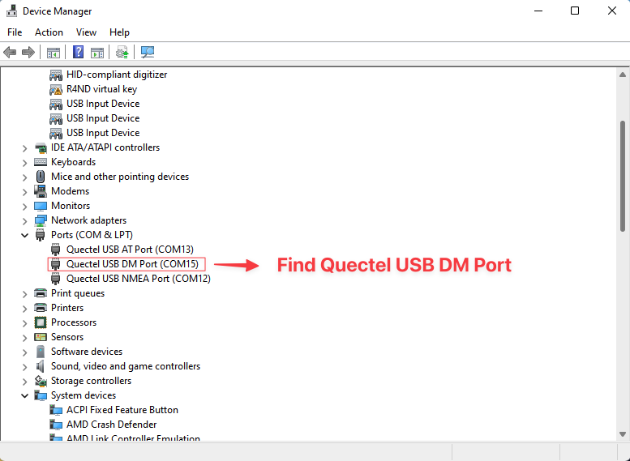
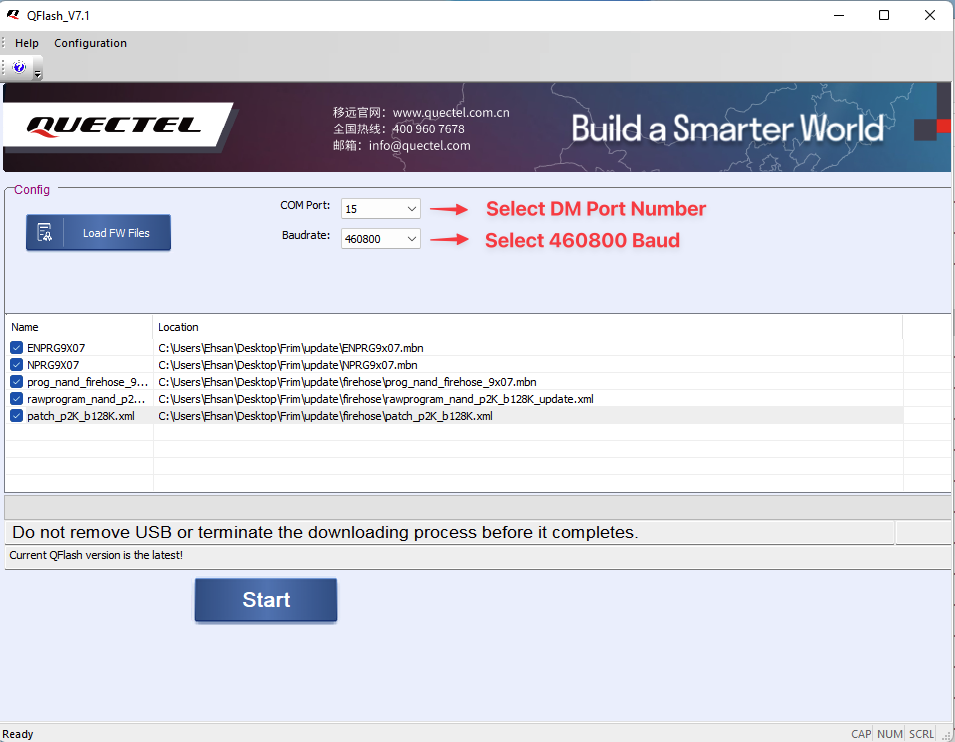
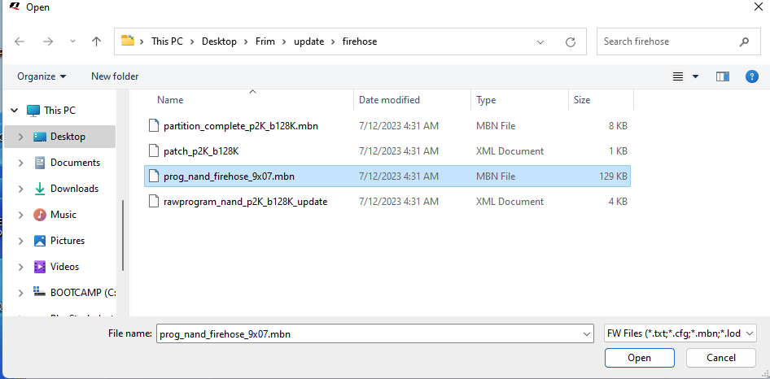

# EC25-G Firmware Update Instructions

This guide will walk you through updating the firmware of the EC25-G modem using QFlash. It involves setting up a Windows environment, installing necessary drivers, and using the QFlash tool.

## Prerequisites
- A virtual machine (VM) running **Windows**.
- Required drivers installed for the modem.
- Firmware files for EC25-G.

---

### Step 1: Install Windows on a Virtual Machine
If you're running on a non-Windows system, you’ll need to install Windows on a virtual machine (VM). You can use software like [VirtualBox](https://www.virtualbox.org/) or [VMware](https://www.vmware.com/) to set up a VM with Windows.

### Step 2: Install Drivers
Ensure that you have the correct drivers installed for your EC25-G modem. You can usually download the drivers from Quectel's website or the manufacturer’s support page.

### Step 3: Find the "Quectel DM COM" Port Number
1. Open **Device Manager** on your Windows VM.
2. Locate the **"Ports (COM & LPT)"** section.
3. Find the **"Quectel DM COM"** entry and note its port number.

The port number should appear similar to what’s shown below:

### Step 4: Install and Open QFlash
1. Download and install **QFlash**, the tool required to flash the EC25-G firmware.
2. Open QFlash after installation.

### Step 5: Select Quectel DM COM Port Number
In QFlash:
1. Select the **COM port** that matches the **"Quectel DM COM"** port number you found in the previous step.

### Step 6: Set Baudrate
In QFlash, set the **Baudrate** to `460800`.

### Step 7: Extract the Upgrade Files
Extract the downloaded firmware files. Inside the extracted folder, you'll find several files, including the required **prog_nand_firehose_9x07.mbn** file.

### Step 8: Select `prog_nand_firehose_9x07.mbn` File
1. In QFlash, navigate to the `Update/firehose` folder from the extracted firmware files.
2. Select the `prog_nand_firehose_9x07.mbn` file.

### Step 9: Click Start to Begin the Update
1. In QFlash, click **Start** to begin the firmware update process.

### Step 10: Handle COM Port Change
- During the update, the COM port may change.
- If you're running QFlash in a VM, you’ll need to select the USB device labeled **"QHSUSB__BULK"** from your VM’s USB device list to continue the update.

### Step 11: Done
Once the process is complete, the firmware update is finished. Your EC25-G modem should now be running the latest firmware version.
